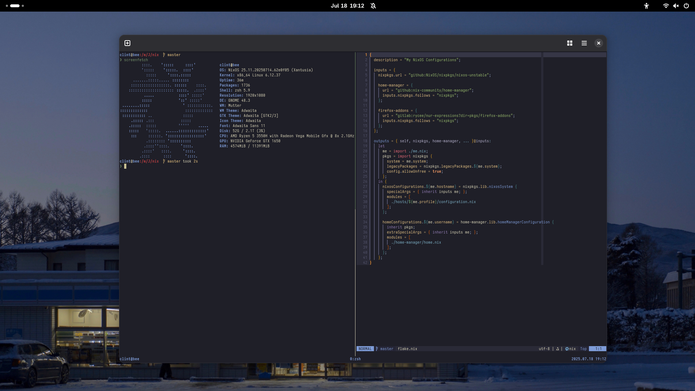

# ❄️ NixOS

My NixOS configuration.




## About

This repository contains my personal NixOS configuration. These configurations
are tailored to my setup and can be used as a base for configuring your own
NixOS environment.

I am not an expert in Nix or NixOS, as I've only been using NixOS since 23.11,
so there are plenty of improvements that can be made.


## Units

| Unit    | Device                  |
|---------|-------------------------|
| Unit-00 | Asus TUF Gaming FX505DT |
| Unit-01 | Acer Swift SF14-51      |
| Unit-03 | Work PC                 |
| Unit-04 | KVM                     |


## Installation

I've done this a lot since I've distro hopped way too many times in the past
and I am way too lazy to manually partition and create the fs for my machine
as I find it to be the most tedious process, I use disko to do the tedious
parts. All I have to do is to clone my (nixos-config) repository, run a couple
of commands and wait for my system to finish installing.

```bash
git clone https://github.com/egargo/nixos-config
nix --experimental-features "nix-command flakes" run github:nix-community/disko/latest -- --mode destroy,format,mount ./nixos-config/disko/btrfs.nix
nixos-generate-config --root /mnt
rm -rf /mnt/etc/nixos/configuration.nix
mv -v nixos-config/* /mnt/etc/nixos
mv -v /mnt/etc/nixos/hardware-configuration.nix /mnt/etc/nixos/profiles/unit-01/hardware-configuration.nix
nixos-install --flake .#bee
nixos-enter --root /mnt -c 'passwd clint'
```


## Setup and configuration

As of the moment, I haven't fully migrated my Neovim to Nix since those
are too large to convert and dump to Nix.

```bash
cp -v /etc/nixos/profiles/unit-01/hardware-configuration.nix profiles/unit-01/hardware-configuration.nix
ln -s "$PWD/config/nvim" ~/.config
rm -rf ~/.config/ghostty
chmod 600 ~/.ssh/key
```


## Management

I use flakes to manage my NixOS configuration. My home and system
configurations are managed with home-manager and nixos, respectively.

```bash
# Flakes
nix flake update
home-manager build switch --flake .
sudo nixos-rebuild switch --flake .

# Clean up
nix-env --list-generations
sudo /run/current-system/bin/switch-to-configuration boot
nix-store --gc && sudo nix-collect-garbage -d
```
