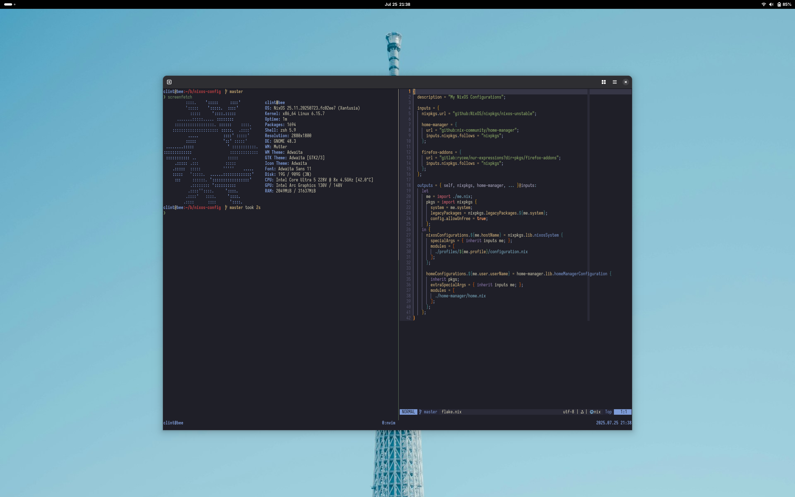

# ❄️ NixOS

My NixOS configuration.




## About

This repository contains my personal NixOS configuration. These configurations
are tailored to my setup and can be used as a base for configuring your own
NixOS environment.

I am not an expert in Nix or NixOS, as I've only been using NixOS since 23.11,
so there are plenty of improvements that can be made.


## Units

| Unit    | Device                  |
|---------|-------------------------|
| unit-00 | Asus TUF Gaming FX505DT |
| unit-01 | Acer Swift SF14-51      |
| unit-03 | Work Machine            |
| unit-04 | Virtual Machine         |


## Installation setup

I've done this a lot since I've distro hopped way too many times in the past
and I am way too lazy to manually partition and create the fs for my machine
as I find it to be the most tedious process, I use disko to do the tedious
parts. All I have to do is to clone my (nixos-config) repository, run a couple
of commands and wait for my system to finish installing.

```bash
git clone https://github.com/egargo/nixos-config
cd nixos-config
./install.sh live-install
poweroff
```


## Post-installation setup and configuration

As of the moment, I haven't fully migrated my Neovim to Nix since those
are too large to convert and dump to Nix.

```bash
git clone https://github.com/egargo/nixos-config
./install.sh post-install
nh home switch .
```


## Management

I use flakes to manage my NixOS configuration. My home and system
configurations are managed with home-manager and nixos, respectively.

```bash
nh os switch -u .
nh home switch .
nh clean all
```
